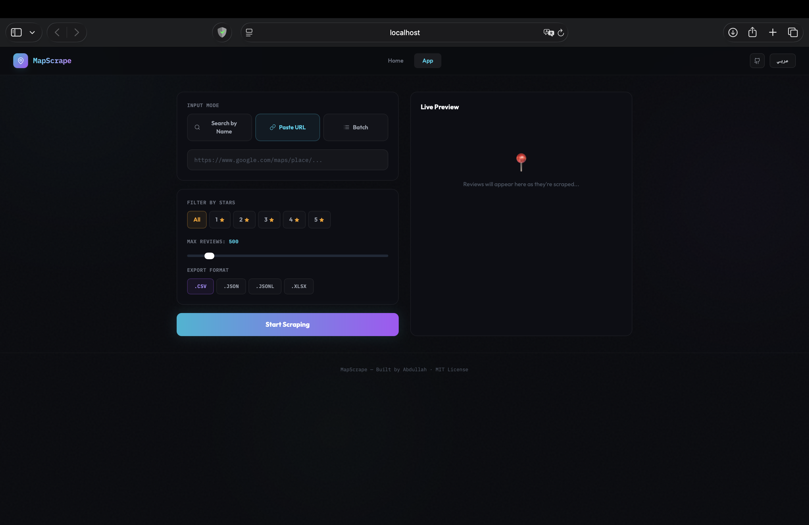
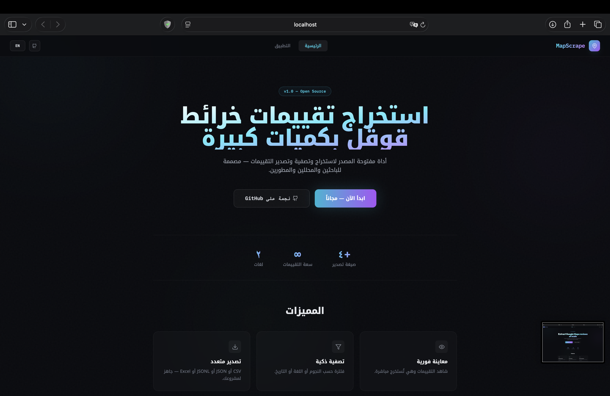

<div align="center">

# 📍 MapScrape

**Extract Google Maps reviews at scale — for free.**

The open-source alternative to Outscraper, built for researchers, analysts, and developers.

[](LICENSE)
[](docker-compose.yml)
[](backend/)
[](frontend/)
[](CONTRIBUTING.md)

[Features](#-features) · [Quick Start](#-quick-start) · [Screenshots](#-screenshots) · [API](#-api-reference) · [Contributing](#-contributing)

</div>

---

## 🎯 Why MapScrape?

Paid tools like Outscraper charge **$50+/month** for Google Maps review data. MapScrape gives you the same capability — **completely free and open source**.

- 🔍 Search by place name **or** paste a Google Maps URL
- 📋 **Batch queue** — paste multiple URLs and scrape them all automatically
- ⭐ Filter by star rating (1-5 or all)
- 📡 **Real-time WebSocket streaming** — watch reviews appear live
- 📦 Export to CSV, JSON, JSONL, or Excel
- 🌐 Full **Arabic & English** UI with RTL support
- 🐳 One-command Docker setup

---

## 📸 Screenshots

<div align="center">

### Landing Page


### Scraping Interface


### Arabic RTL Mode


</div>

---

## ✨ Features

| Feature | Description |
|---------|-------------|
| 🔍 **Dual Input** | Search by place name or paste a direct Google Maps URL |
| 📋 **Batch Queue** | Paste multiple URLs and scrape them all automatically |
| ⭐ **Star Filter** | Extract only 1-star, 3-star, 5-star, or all reviews |
| 📡 **Real-time Stream** | Reviews appear live via WebSocket — no waiting |
| 📦 **Multi-Export** | Download as `.csv`, `.json`, `.jsonl`, or `.xlsx` |
| 🌐 **Bilingual** | Full Arabic (RTL) and English UI |
| 🇸🇦 **Arabic Parsing** | Correctly parses Arabic star labels (واحدة، نجمتان، ثلاث نجوم...) |
| 🐳 **Docker Ready** | One command to run everything |
| 🔓 **MIT License** | Free forever, modify as you wish |

---

## 🚀 Quick Start

### Prerequisites

- [Docker](https://docs.docker.com/get-docker/) & [Docker Compose](https://docs.docker.com/compose/install/)
- That's it!

### Run with Docker (Recommended)

```bash
# Clone the repo
git clone https://github.com/3bdullahCS/mapscrape.git
cd mapscrape

# Start everything
docker-compose up --build

# That's it! Open your browser:
# Frontend → http://localhost:3000
# API Docs → http://localhost:8000/docs
```

### Run Manually (Development)

<details>
<summary>Click to expand</summary>

**Backend:**

```bash
cd backend
python -m venv venv
source venv/bin/activate       # Windows: venv\Scripts\activate
pip install -r requirements.txt

# You need Chrome + ChromeDriver installed
uvicorn main:app --reload --port 8000
```

**Frontend:**

```bash
cd frontend
npm install
npm run dev
```

Open http://localhost:3000

</details>

---

## 🏗️ Architecture

```
┌──────────────────────┐         WebSocket          ┌──────────────────────┐
│                      │  ◄─────────────────────►  │                      │
│   React + Vite       │                            │   FastAPI            │
│   Tailwind CSS       │         REST API           │   Selenium + Chrome  │
│                      │  ◄─────────────────────►  │   (Headless)         │
│   Port 3000          │                            │   Port 8000          │
└──────────────────────┘                            └──────────────────────┘
        ▲                                                     │
        │                                                     ▼
   User Browser                                     Google Maps Pages
```

**How it works:**

1. User enters a place name, URL, or multiple URLs (batch mode) in the frontend
2. Frontend opens a WebSocket connection to the backend
3. Backend launches headless Chrome, navigates to Google Maps
4. Selenium scrolls through the reviews panel, loading more
5. Each review is extracted and streamed back via WebSocket
6. In batch mode, places are processed one by one with progress tracking
7. Frontend displays reviews in real-time with progress bar
8. User downloads all results in their preferred format

---

## 📡 API Reference

### WebSocket — Real-time Scraping

Connect to `ws://localhost:8000/ws/scrape`

**Single URL:**
```json
{
  "action": "start",
  "url": "https://www.google.com/maps/place/...",
  "target_stars": 0,
  "max_reviews": 500,
  "max_scrolls": 100
}
```

**Batch (multiple URLs):**
```json
{
  "action": "start",
  "urls": [
    "https://www.google.com/maps/place/Place1...",
    "https://www.google.com/maps/place/Place2...",
    "https://www.google.com/maps/place/Place3..."
  ],
  "target_stars": 5,
  "max_reviews": 200,
  "max_scrolls": 100
}
```

**Receive (streamed):**
```json
{"type": "place_start", "place_index": 0, "total_places": 3, "url": "..."}
{"type": "status",      "message": "[1/3] Scroll 15/100 — 230 reviews loaded", "progress": 0.12}
{"type": "review",      "data": {"text": "الأكل لذيذ!", "rating": 5, "author": "محمد", "date": "قبل أسبوع"}}
{"type": "place_done",  "place_index": 0, "reviews_so_far": 42}
{"type": "complete",    "job_id": "abc123", "total": 450}
```

### REST Endpoints

| Method | Endpoint | Description |
|--------|----------|-------------|
| `GET` | `/` | Health check |
| `GET` | `/health` | API status |
| `GET` | `/api/jobs/{id}` | Get job status & results |
| `GET` | `/api/export/{id}?format=csv` | Download results as file |

Full interactive docs at http://localhost:8000/docs

---

## 📁 Project Structure

```
mapscrape/
├── backend/
│   ├── main.py              # FastAPI app, REST + WebSocket (single + batch)
│   ├── scraper.py           # Selenium Google Maps scraper class
│   ├── requirements.txt     # Python dependencies
│   └── Dockerfile           # Backend container (includes Chromium)
├── frontend/
│   ├── src/
│   │   ├── App.jsx          # Main app with page routing
│   │   ├── i18n.js          # Arabic & English translations
│   │   ├── components/
│   │   │   ├── LandingPage.jsx    # Hero + features
│   │   │   ├── ScrapePanel.jsx    # Scraping interface (single + batch)
│   │   │   ├── ReviewCard.jsx     # Individual review display
│   │   │   ├── ProgressBar.jsx    # Real-time progress indicator
│   │   │   └── StarRating.jsx     # Star rating component
│   │   └── hooks/
│   │       └── useScraper.js      # WebSocket connection hook
│   ├── tailwind.config.js
│   ├── vite.config.js
│   ├── package.json
│   └── Dockerfile
├── docs/                    # Screenshots & documentation
├── .github/
│   ├── ISSUE_TEMPLATE/      # Bug report & feature request templates
│   └── workflows/           # CI/CD pipeline
├── docker-compose.yml       # One-command full stack setup
├── CONTRIBUTING.md          # How to contribute
├── LICENSE                  # MIT
└── README.md                # You are here
```

---

## ⚙️ Configuration

| Variable | Default | Description |
|----------|---------|-------------|
| `VITE_API_URL` | `http://localhost:8000` | Backend API URL |
| `VITE_WS_URL` | `ws://localhost:8000/ws/scrape` | WebSocket URL |

Copy `.env.example` to `.env` and customize:

```bash
cp frontend/.env.example frontend/.env
```

---

## 🤝 Contributing

Contributions are welcome! See [CONTRIBUTING.md](CONTRIBUTING.md) for guidelines.

```bash
# Fork → Clone → Branch → Code → PR
git checkout -b feature/your-feature
git commit -m "Add your feature"
git push origin feature/your-feature
```

---

## 🗺️ Roadmap

- [x] Core scraping engine with Arabic support
- [x] Real-time WebSocket streaming
- [x] Bilingual UI (Arabic/English)
- [x] Multi-format export (CSV, JSON, JSONL, Excel)
- [x] Batch queue — scrape multiple places at once
- [ ] Google Places API integration for search
- [ ] Sentiment analysis preview (CAMeLBERT)
- [ ] Rate limiting & proxy rotation
- [ ] User accounts & scrape history
- [ ] Hosted version with free tier

---

## ⚠️ Disclaimer

This tool is intended for **educational and research purposes**. Please be responsible when scraping — respect Google's Terms of Service and rate-limit your requests. The authors are not liable for any misuse.

---

## 📄 License

[MIT](LICENSE) — free forever.

---

<div align="center">

**Built with ❤️ by Abdullah** 🇸🇦

If this tool saved you time or money, consider giving it a ⭐

</div>